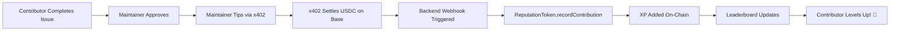

# Base-OSS-MVP: OSS platform on Base 🔵

[](https://base.org)
[](https://docs.cdp.coinbase.com/x402)
[](https://onchainkit.xyz)

> **Matching quality contributors with Base ecosystem projects through on-chain reputation and instant USDC rewards**

## 🎯 The Problem

**For Contributors:**
- 😓 Hard to discover Base ecosystem projects that match their skills
- ⏰ Unclear which issues are worth their time
- 💸 No immediate rewards for OSS contributions
- 📊 No portable proof of their work across projects

**For Maintainers:**
- 🔍 Difficulty attracting quality contributors
- ❓ No way to verify contributor experience
- 💰 Complex payment flows for rewarding contributors
- 📉 High contributor churn rates

## 💡 Our Solution

**Base-OSS-MVP** bridges this gap by creating a gamified OSS contribution platform specifically for the Base ecosystem, featuring:

- 🎯 **Smart Matching**: AI-powered matching between contributors and Base projects (AgentKit, OnchainKit, 0x402, etc.)
- 🏆 **On-Chain Reputation**: Permanent XP and level tracking via ReputationToken smart contract
- ⚡ **Instant Rewards**: x402-powered USDC micropayments with zero friction
- 📊 **Transparent Leaderboards**: Verifiable proof of contributions across all Base projects
- 🎮 **Gamification**: Level up, earn badges, and compete on weekly/monthly leaderboards

## 🏗️ Architecture

### Hybrid On-Chain + Off-Chain Design

We use a **strategic hybrid approach** optimized for Base's strengths:

```
┌─────────────────────────────────────────────────────────┐
│                    USER INTERFACE                        │
│            (Next.js + OnchainKit + Privy)               │
└─────────────────────────────────────────────────────────┘
                           │
         ┌─────────────────┴─────────────────┐
         ▼                                   ▼
┌──────────────────┐              ┌──────────────────┐
│  Supabase (DB)   │              │  Base Blockchain  │
├──────────────────┤              ├──────────────────┤
│ • User Profiles  │              │ • ReputationToken│
│ • Repo Metadata  │              │   (XP/Levels)    │
│ • Issues         │              │ • x402 Payments  │
│ • Applications   │              │   (USDC Tips)    │
│ • Activity Logs  │              │                  │
└──────────────────┘              └──────────────────┘
         │                                   │
         └─────────────────┬─────────────────┘
                           ▼
                   ┌──────────────┐
                   │  Leaderboard  │
                   │   (Real-time) │
                   └──────────────┘
```

**Why This Hybrid Approach?**
- ✅ **Fast Queries**: Supabase handles complex filtering (tech stack, topics, difficulty)
- ✅ **Low Cost**: Only financial + reputation data goes on-chain
- ✅ **Transparency**: All rewards and XP are verifiable on Base
- ✅ **Scalability**: Database handles read-heavy operations

### Data Flow



## 🛠️ Tech Stack

### Frontend
- **Next.js 14** - React framework with App Router
- **OnchainKit** - Coinbase's toolkit for building onchain apps
- **Privy** - Seamless wallet authentication
- **Tailwind CSS** - Styling
- **shadcn/ui** - Component library

### Backend
- **Supabase** - PostgreSQL database + real-time subscriptions
- **x402 Starter Kit** - USDC micropayment infrastructure
- **Viem** - Ethereum interactions

### Blockchain (Base Sepolia)
- **ReputationToken.sol** - On-chain XP and contribution tracking
- **x402 Protocol** - Gasless USDC transfers for tipping
- **Base L2** - Low fees, fast finality

## 🚀 Quick Start

### Prerequisites

- Node.js 18+
- A wallet with Base Sepolia ETH (for gas)
- [Base Sepolia Faucet](https://www.coinbase.com/faucets/base-ethereum-sepolia-faucet)

### Installation

```bash
# Clone the repository
git clone https://github.com/yourusername/base-oss-mvp.git
cd base-oss-mvp

# Install dependencies
npm install

# Set up environment variables
cp .env.example .env
```

### Environment Configuration

Create a `.env.local` file:

```env
# Frontend
NEXT_PUBLIC_PROJECT_NAME="Base OSS"
NEXT_PUBLIC_ONCHAINKIT_API_KEY=your_cdp_api_key
NEXT_PUBLIC_URL=http://localhost:3000

# Supabase
NEXT_PUBLIC_SUPABASE_URL=your_supabase_url
NEXT_PUBLIC_SUPABASE_ANON_KEY=your_supabase_key

# Privy (Wallet Auth)
NEXT_PUBLIC_PRIVY_APP_ID=your_privy_app_id

# x402 Payment Configuration
PAY_TO_ADDRESS=your_maintainer_wallet
NETWORK=base-sepolia
FACILITATOR_URL=https://x402.org/facilitator

# Smart Contracts
REPUTATION_CONTRACT_ADDRESS=0xYourDeployedContractAddress
ADMIN_PRIVATE_KEY=your_admin_key_for_recording_contributions

# Optional: Custom RPC
RPC_URL=https://base-sepolia.g.alchemy.com/v2/your-key
```

### Running the Application

```bash
# Development mode
npm run dev

# Build for production
npm run build
npm start

# Access at http://localhost:3000
```

## 📱 Key Features

### For Contributors

1. **Browse Base Ecosystem Projects**
   - Filter by tech stack (Solidity, TypeScript, React)
   - Filter by topics (DeFi, NFTs, AI Agents)
   - See "good first issues" highlighted

2. **Apply to Issues**
   - One-click application with profile matching
   - Track application status
   - See estimated XP rewards

3. **Earn & Level Up**
   - Complete issues → Receive USDC tips via x402
   - Automatically earn XP on-chain
   - Level up and climb the leaderboard
   - Earn badges for milestones (5, 10, 25+ contributions)

4. **Build Reputation**
   - All XP stored permanently on Base
   - Portable across all Base ecosystem projects
   - Verifiable proof of contributions

### For Maintainers

1. **List Your Repository**
   - Add Base ecosystem projects
   - Tag issues by difficulty and tech stack
   - Set suggested tip amounts

2. **Manage Contributors**
   - Review applications
   - Assign issues
   - Track progress

3. **Reward Instantly**
   - Tip contributors in USDC via x402
   - No gas fees for contributors
   - Automatic XP assignment on-chain

### Leaderboard

- **All-Time Rankings** - Top contributors across all projects
- **Monthly/Weekly** - Recent performance tracking
- **Skill-Based** - Filter by technology (Solidity devs, Frontend devs, etc.)
- **Live Updates** - Real-time rank changes

## 🎮 How It Works

### Step-by-Step Flow

**1. Discovery Phase**
```
Contributor visits platform
    → Connects wallet (Privy)
    → Browses Base ecosystem repos
    → Filters by skills (e.g., "Solidity" + "DeFi")
```

**2. Application Phase**
```
Finds interesting issue
    → Applies with one click
    → Maintainer reviews profile
    → Issue assigned ✅
```

**3. Contribution Phase**
```
Contributor works on issue
    → Submits PR on GitHub
    → Updates status on platform
    → Maintainer reviews & approves
```

**4. Reward Phase**
```
Maintainer tips contributor (e.g., $10 USDC)
    → x402 processes payment
    → USDC sent instantly to contributor
    → Backend webhook triggered
    → ReputationToken.recordContribution() called
    → 1,000 XP added on-chain
    → Leaderboard updates
    → Contributor levels up! 🎉
```

## 💎 Smart Contracts

### ReputationToken.sol

Deployed on **Base Sepolia**: `0xYourContractAddress`

**Key Functions:**
```solidity
// Record a contribution (called by backend after tip)
function recordContribution(
    address contributor,
    uint256 xpAmount,
    uint256 tipAmount
) external;

// View contributor stats
function getContributor(address addr) 
    returns (uint256 totalXP, uint256 level, uint256 contributions);

// Get time-based XP for leaderboards
function getMonthlyXP(address addr) returns (uint256);
function getWeeklyXP(address addr) returns (uint256);
```

**Features:**
- ✅ Permanent XP tracking
- ✅ Automatic level calculation
- ✅ Monthly/weekly stats for leaderboards
- ✅ Total earnings tracking (in USDC)
- ✅ Contribution count

### x402 Integration

We use the **x402 Starter Kit** for USDC micropayments:

```typescript
// Maintainer tips contributor
const payment = await x402Client.createPayment({
  amount: "10000000", // $10 USDC (6 decimals)
  recipient: contributorAddress,
  network: "base-sepolia",
});

// Payment settles instantly
// → Contributor receives USDC
// → Backend records XP on-chain
// → No gas fees for contributor
```

**Benefits:**
- ⚡ Instant settlement (< 5 seconds)
- 💰 No gas fees for recipients
- 🔒 Secure EIP-3009 authorization
- 🌐 Works across Base ecosystem

## 🎯 Base Track Alignment

### Why We Built on Base

1. **Low Fees** - Enables micro-tipping ($1-$10) economically viable
2. **Fast Finality** - Instant XP updates and leaderboard changes
3. **EVM Compatible** - Easy integration with existing tools
4. **Ecosystem Focus** - Built specifically for Base projects

### Bonus Integrations Used

- ✅ **OnchainKit** - Wallet integration, transaction handling
- ✅ **x402** - Micropayment infrastructure
- 🔄 **AgentKit** (planned) - AI-powered contributor-issue matching
- ✅ **Base SDK** - Contract interactions via Viem

## 📊 Complete Entity-Relationship Diagram
```
┌─────────────┐
│  PROFILES   │ ← Strong Entity (main user table)
│ (wallet_addr│
│  as PK)     │
└──────┬──────┘
       │
       │ 1:M (maintains)
       ▼
┌─────────────┐
│  PROJECTS   │ ← Strong Entity (independent)
└──────┬──────┘
       │
       │ 1:M
       ▼
┌─────────────┐       ┌──────────────┐
│REPOSITORIES │ 1:M   │    ISSUES    │ ← Weak Entity
└──────┬──────┘───────►              │
       │              └───┬──────────┘
       │                  │
       │ M:M              │ M:M
       │ (via             │ (via
       │  applications)   │  tips)
       │                  │
       ▼                  ▼
┌──────────────┐   ┌──────────────┐
│ APPLICATIONS │   │     TIPS     │ ← Junction Tables
│ (junction)   │   │  (junction)  │
└──────────────┘   └──────────────┘
       ▲                  ▲
       │                  │
       │ M:M              │ M:M
       │                  │
       └──────────────────┘
              PROFILES
```

---

## ✅ Summary: Your Assessment

| Table | Your Assessment | Correct? | Actual Type |
|-------|----------------|----------|-------------|
| `profile_registry.sql` | Depends on User | ⚠️ | **Strong Entity** (primary user table) |
| `application_manager.sql` | Tracks users | ✅ | **Junction Table** (profiles ↔ issues) |
| `projects.sql` | About projects | ✅ | **Strong Entity** |
| `repo_registry.sql` | Related to projects | ✅ | **Weak Entity** (depends on projects) |
| `tip_jar.sql` | Weak, M:M relationship | ✅ | **Junction Table** (profiles ↔ issues) |

---

## 🎯 Recommended Final Schema
```
profiles (Strong Entity - wallet_address PK)
    ↓ 1:M
projects (Strong Entity)
    ↓ 1:M
repositories (Weak Entity)
    ↓ 1:M
issues (Weak Entity)
    ↓ M:M (via applications)
applications (Junction Table)
    ↓ M:M (via tips)
tips (Junction Table)

